# GEMINI Project Documentation: Chessground Game App

## 1. Executive Summary

This document provides a comprehensive analysis of the `chessground_game_app`, a Flutter-based cross-platform chess application. The app is designed with **Clean Architecture** principles, ensuring separation of concerns, maintainability, and testability.

**Project Status:** 🟡 **Partially Complete**
- ✅ **Fully Implemented:** Computer Game (AI), Offline Game (2-Player), Game History, Settings
- 🟡 **Partially Implemented:** Game Controls (missing navigation features), End Game Interfaces (TODOs)
- ❌ **Not Implemented:** Online Multiplayer, Puzzle Mode

**Key Information:**
- **Framework:** Flutter 3.9.0+
- **Architecture:** Clean Architecture (Data → Domain → Presentation)
- **State Management:** GetX
- **Dependency Injection:** Get (formerly GetIt, migrated in recent refactoring)
- **Database:** Isar (local embedded NoSQL)
- **Chess Engine:** Stockfish via `stockfish` package (v1.7.1)
- **UI Rendering:** Chessground (v7.1.6) + Dartchess (v0.11.1)

---

## 2. Technology Stack

### Core Dependencies

| Package | Version | Purpose |
|---------|---------|---------|
| **flutter** | SDK | Cross-platform UI framework |
| **get** | ^4.7.2 | State management, routing, and dependency injection |
| **chessground** | ^7.1.6 | Interactive chessboard widget with sophisticated UI |
| **dartchess** | ^0.11.1 | Core chess logic (move generation, validation, FEN/PGN) |
| **stockfish** | ^1.7.1 | Stockfish chess engine integration for AI gameplay |
| **isar** | ^3.1.0+1 | Fast, ACID-compliant embedded database |
| **isar_flutter_libs** | git | Platform-specific Isar libraries |
| **freezed** | any | Code generation for immutable data classes |
| **json_serializable** | ^4.9.0 | JSON serialization/deserialization |
| **dartz** | ^0.10.1 | Functional programming patterns (Either, Option) |
| **equatable** | ^2.0.7 | Value equality for entities |
| **get_storage** | ^2.1.1 | Simple key-value storage |
| **shared_preferences** | ^2.5.3 | Platform-agnostic persistent storage |
| **dio** | ^5.9.0 | HTTP client (prepared for online features) |
| **intl** | ^0.20.2 | Internationalization support |
| **flutter_localizations** | SDK | Material/Cupertino localizations |

### Development Dependencies

| Package | Version | Purpose |
|---------|---------|---------|
| **build_runner** | any | Code generation runner |
| **isar_generator** | any | Generates Isar collection code |
| **mocktail** | ^1.0.4 | Mocking library for testing |
| **flutter_lints** | ^5.0.0 | Linting rules |
| **lint** | ^2.8.0 | Additional lint rules |
| **fake_async** | ^1.3.3 | Testing asynchronous code |

### UI/UX Enhancements

| Package | Purpose |
|---------|---------|
| `material_symbols_icons` (^4.2874.0) | Extended icon set |
| `material_design_icons_flutter` (^7.0.7296) | Material design icons |
| `chess_vectors_flutter` (^1.1.0) | Chess piece SVG assets |
| `cached_network_image` (^3.4.1) | Network image caching |
| `auto_size_text` (^3.0.0) | Responsive text sizing |
| `sound_effect` (^0.1.1) | Audio playback for moves |
| `image_picker` (^1.2.0) | Player avatar selection |
| `url_launcher` (^6.3.2) | External URL handling |
| `share_plus` (^12.0.1) | Game sharing functionality |
| `dynamic_system_colors` (^1.8.0) | System color integration |
| `pull_to_refresh` (^2.0.0) | Refresh gesture support |

---

## 3. Project Architecture

### Directory Structure

```
chessground_game_app/
├── android/                    # Android platform code
├── ios/                        # iOS platform code
├── lib/
│   ├── core/                   # Shared utilities and global features
│   │   ├── connection/         # Network connectivity checking
│   │   ├── databases/          # API and cache infrastructure
│   │   │   ├── api/            # Dio HTTP client setup
│   │   │   └── cache/          # Shared preferences wrapper
│   │   ├── errors/             # Error handling (Failures, Exceptions)
│   │   ├── global_feature/     # Core chess game logic (Clean Architecture)
│   │   │   ├── data/           # Data layer
│   │   │   │   ├── collections/    # Isar database collections
│   │   │   │   ├── datasources/    # Data source implementations
│   │   │   │   ├── models/         # Data models (with Freezed)
│   │   │   │   └── repositories/   # Repository implementations
│   │   │   ├── domain/         # Domain layer
│   │   │   │   ├── converters/    # Entity/Model converters
│   │   │   │   ├── entities/      # Business entities
│   │   │   │   ├── repositories/  # Repository contracts (abstract)
│   │   │   │   ├── services/      # Domain services
│   │   │   │   └── usecases/      # Business logic use cases
│   │   │   └── presentaion/   # Shared presentation components
│   │   │       ├── controllers/   # Base controllers
│   │   │       └── widgets/       # Shared widgets
│   │   ├── params/             # Common parameters
│   │   └── utils/              # Utilities (logger, helpers, dialogs)
│   ├── di/                     # Dependency injection setup
│   │   └── ingection_container.dart
│   ├── features/               # Feature modules
│   │   ├── computer_game/      # ✅ Play vs. AI (Complete)
│   │   ├── home/               # ✅ Home screen & navigation (Complete)
│   │   ├── offline_game/       # ✅ Pass-and-play mode (Complete)
│   │   ├── online_game/        # ❌ Online multiplayer (Stub only)
│   │   ├── puzzle/             # ❌ Chess puzzles (Stub only)
│   │   ├── recent_screen/      # ✅ Game history viewer (Complete)
│   │   └── settings/           # ✅ App settings (Complete)
│   ├── l10n/                   # Localization files
│   ├── routes/                 # GetX routing configuration
│   │   ├── app_pages.dart
│   │   └── game_binding.dart
│   └── main.dart               # App entry point
├── test/                       # Unit and widget tests
├── assets/                     # Images, sounds, etc.
└── pubspec.yaml                # Dependencies
```

### Clean Architecture Layers

```mermaid
graph LR
    subgraph Presentation["🎨 Presentation Layer"]
        UI[UI Widgets]
        Controllers[GetX Controllers]
    end
    
    subgraph Domain["💼 Domain Layer"]
        UseCases[Use Cases]
        Repositories[Repository Interfaces]
        Entities[Domain Entities]
    end
    
    subgraph Data["💾 Data Layer"]
        RepositoriesImpl[Repository Implementations]
        DataSources[Data Sources]
        Models[Data Models]
    end
    
    subgraph External["🔌 External"]
        Isar[(Isar DB)]
        Stockfish[Stockfish Engine]
        Cache[GetStorage]
        API[REST API - dio]
    end
    
    UI --> Controllers
    Controllers --> UseCases
    UseCases --> Repositories
    RepositoriesImpl -.implements.- Repositories
    RepositoriesImpl --> DataSources
    DataSources --> Isar
    DataSources --> Stockfish
    DataSources --> Cache
    DataSources --> API
    
    style Presentation fill:#e1f5ff
    style Domain fill:#d4edda
    style Data fill:#fff3cd
    style External fill:#f8d7da
```



#### Layer Breakdown

**1. Presentation Layer** (`features/.../presentation`)
- **Pages**: Full-screen UI components
- **Widgets**: Reusable UI components
- **Controllers**: GetX controllers managing UI state
- **Bindings**: Dependency injection for controllers

**2. Domain Layer** (`core/global_feature/domain`)
- **Entities**: Pure business objects (e.g., `ChessGameEntity`, `PlayerEntity`)
- **Use Cases**: Single-responsibility business logic (e.g., `SaveGameUseCase`, `PlayMoveUseCase`)
- **Repositories (Abstract)**: Contracts defining data operations
- **Services**: Complex business logic spanning multiple entities

**3. Data Layer** (`core/global_feature/data`)
- **Models**: JSON-serializable data transfer objects (Freezed)
- **Data Sources**: 
  - `ChessGameLocalDataSource` - Isar database operations
  - `StockfishDataSource` - Chess engine interactions
  - `GameStateCacheDataSource` - In-memory game state caching
  - `PlayerLocalDataSource` - Player data persistence
- **Repositories (Implementations)**: Bridge between domain and data sources

---

## 4. Implemented Features

### ✅ Computer Game (Play vs. AI)

**Files:**
- `lib/features/computer_game/presentation/`
- Controllers: `GameComputerController`, `GameComputerWithTimeController`
- Pages: `GameComputerPage`, `GameComputerWithTimePage`, `SideChoosingPage`

**Capabilities:**
- Choose side (White/Black/Random)
- Adjust AI difficulty:
  - UCI Elo rating (1350-2850)
  - Skill level (0-20)
  - Search depth (1-20)
  - Thinking time (100-5000ms)
- Timed and untimed games
- Undo/redo moves
- PGN export
- Game saving and history
- Visual evaluation bar
- Material count display

**Architecture:**
- Uses `StockfishDataSource` for AI move generation
- Extends `BaseGameController`
- Implements end game interfaces (with TODOs)

---

### ✅ Offline Game (2-Player Pass-and-Play)

**Files:**
- `lib/features/offline_game/presentation/`
- Controllers: `OfflineGameController`, `FreeGameController`
- Pages: `OfflineGamePage`, `FreeGamePage`, `NewGamePage`

**Capabilities:**
- Local multiplayer on same device
- Both timed and untimed modes
- Custom player names and avatars
- Game saving
- Full move history with PGN

**Architecture:**
- No AI dependency
- Clean game state management
- Time control support via `ChessClockService`

---

### ✅ Recent Games (Game History)

**Files:**
- `lib/features/recent_screen/presentation/`
- Controller: `RecentGamesController`
- Page: `RecentGamesPage`

**Capabilities:**
- View all saved games
- Filter by player
- Delete games
- Review game moves
- Mini board preview

**Architecture:**
- Uses `GetRecentGamesUseCase`
- Queries Isar database via `ChessGameLocalDataSource`

---

### ✅ Settings

**Files:**
- `lib/features/settings/presentation/`
- Controller: `SettingsController`
- Page: `SettingsPage`

**Capabilities:**
- Board theme selection (multiple themes)
- Piece set customization
- Sound effects toggle
- Language selection (Arabic/English supported)
- Board orientation toggle

**Storage:**
- Persisted via `GetStorage`

---

### ✅ Home Screen & Navigation

**Files:**
- `lib/features/home/presentation/pages/home_page.dart`
- `lib/routes/app_pages.dart`

**Capabilities:**
- Navigation to all game modes
- Quick start buttons
- Settings access
- Game history access

---

## 5. Missing Features

### ❌ Online Game (Multiplayer)

**Current State:** Stub implementation with `UnimplementedError` thrown in all methods

**Required Implementation:**

#### Data Layer (Missing)
```
lib/features/online_game/data/
├── datasources/
│   ├── online_game_remote_datasource.dart  # WebSocket/REST API
│   └── online_game_cache_datasource.dart   # Local cache
├── models/
│   ├── online_game_model.dart
│   └── online_move_model.dart
└── repositories/
    └── online_game_repository_impl.dart
```

**Needed:**
- WebSocket connection for real-time moves
- Game session management
- Move synchronization
- Opponent matching/invitations
- Draw offers/resignations
- Time control synchronization

#### Domain Layer (Partial)
**Exists:** `lib/features/online_game/domain/usecases/play_move.dart`
**Missing:**
- `ConnectToGameUsecase`
- `SendMoveUsecase`
- `ReceiveMovesUsecase`
- `OfferDrawUsecase`
- `AcceptDrawUsecase`
- `ResignGameUsecase`
- Entity definitions
- Repository contract

#### Presentation Layer (Stub)
**File:** `lib/features/online_game/presentation/controllers/online_game_controller.dart`

**Methods to Implement:**
- `connectToGame(String gameId)`
- `sendMove(NormalMove move)`
- `receiveMoves()` (Stream)
- `offerDraw()`
- `acceptDraw()`
- `declineDraw()`
- `resign(Side side)`
- All end game interface methods (8 TODOs)

**Missing UI:**
- Online game page
- Matchmaking screen
- Lobby/room system
- Connection status indicators

---

### ❌ Puzzle Mode

**Current State:** Stub implementation, completely non-functional

**Required Implementation:**

#### Data Layer (Missing)
```
lib/features/puzzle/data/
├── datasources/
│   ├── puzzle_remote_datasource.dart  # API for puzzle DB
│   └── puzzle_local_datasource.dart   # Cache solved puzzles
├── models/
│   ├── puzzle_model.dart
│   └── puzzle_solution_model.dart
└── repositories/
    └── puzzle_repository_impl.dart
```

**Puzzle Data Structure:**
- Puzzle ID
- FEN position
- Themes/categories
- Rating/difficulty
- Solution moves
- Explanations

#### Domain Layer (Missing)
```
lib/features/puzzle/domain/
├── entities/
│   ├── puzzle_entity.dart
│   └── puzzle_stats_entity.dart
├── repositories/
│   └── puzzle_repository.dart
└── usecases/
    ├── load_puzzle_usecase.dart
    ├── check_solution_usecase.dart
    ├── get_hint_usecase.dart
    └── save_puzzle_stats_usecase.dart
```

#### Presentation Layer (Stub)
**File:** `lib/features/puzzle/presentation/controllers/puzzles_game_controller.dart`

**Methods to Implement:**
- `loadPuzzle(String puzzleId)`
- `checkSolution(List<String> moves)`
- `getHint()`
- `showSolution()`
- All end game interface methods (8 TODOs)

**Missing UI:**
- Puzzle browser
- Puzzle board with constraints
- Solution checker
- Progress tracking
- Rating display

**Puzzle Source Options:**
- [ ] Lichess puzzle API
- [ ] Local puzzle database
- [ ] Custom puzzle import

---

### 🟡 Game Controls (Partially Implemented)

**File:** `lib/core/global_feature/presentaion/widgets/game_controls_widget.dart`

**Missing Features:**
```dart
// Line 97
// TODO: Implement navigation to first move

// Line 109  
// TODO: Implement navigation to last move

// Line 121
// TODO: Implement board flip
```

**Impact:** Users cannot:
- Jump to game start/end
- Flip board perspective
- Navigate move history efficiently

---

### 🟡 End Game Interfaces (TODO Comments)

**Affected Controllers:**
- `OfflineGameController` (8 TODOs at lines 420-462)
- `OnlineGameController` (8 TODOs at lines 78-120)
- `PuzzlesGameController` (8 TODOs at lines 46-88)
- `FreeGameController` (8 TODOs at lines 301-343)

**Methods with `throw UnimplementedError()`:**
1. `agreeDraw()` - Handle draw agreement in multiplayer
2. `checkMate()` - Trigger checkmate end game flow
3. `draw()` - Handle general draw conditions
4. `fiftyMoveRule()` - End game on 50-move rule
5. `insufficientMaterial()` - End game on insufficient material
6. `staleMate()` - Handle stalemate
7. `threefoldRepetition()` - End game on threefold repetition
8. `timeOut()` - Handle time forfeit

**Note:** Some controllers (e.g., `GameComputerController`) have proper implementations of these interfaces.

---

## 6. Test Coverage Analysis

### Existing Tests (21 files)

**Core - Data Layer:**
- ✅ `chess_game_local_datasource_test.dart` (2 versions)
- ✅ `game_state_cache_datasource_test.dart`
- ✅ `stockfish_datasource_test.dart`
- ✅ `game_state_repository_impl_test.dart`
- ✅ `isar_chess_game_test.dart`
- ✅ Various PGN parsing tests

**Core - Domain Layer:**
- ✅ `chess_game_storage_service_test.dart`
- ✅ Game state tests

**Core - Presentation:**
- ✅ `free_game_controller_test.dart`

**Features:**
- ✅ `offline_game_controller_test.dart`

**General:**
- ✅ `endgame_conditions_test.dart`
- ✅ `game_state_test.dart`
- ✅ `widget_test.dart`

### Missing Tests

**Controllers:**
- ❌ `GameComputerController`
- ❌ `GameComputerWithTimeController`
- ❌ `OnlineGameController`
- ❌ `PuzzlesGameController`
- ❌ `RecentGamesController`
- ❌ `SettingsController`

**Use Cases:** (Most untested)
- Game use cases (save, update, delete, get)
- Player use cases
- Game state caching use cases

**Widgets:**
- ❌ Most UI widgets lack widget tests

**Integration Tests:**
- ❌ No end-to-end flow tests

---

## 7. Known Issues & Technical Debt

### Critical Issues

**1. Build Configuration (Android)**
**File:** `android/app/build.gradle.kts`
**Lines:** 23-24, 35-37

```kotlin
// TODO: Specify your own unique Application ID
applicationId = "com.example.chessground_game_app"

// TODO: Add your own signing config for the release build.
signingConfig = signingConfigs.getByName("debug")
```

**Impact:** Cannot publish to Play Store without unique app ID and proper signing.

---

### Code Quality Issues

**2. Massive TODO Count**
- 50+ TODO comments project-wide
- Most in end game interface implementations
- Some in game controls

**3. Commented-Out Code**
**Analysis from `REFACTORING_REPORT.md`:**
- `freee_game_controller.dart:284` - 200+ lines of obsolete code
- `recent_games.dart` - Entire file commented out
- Multiple commented imports

**Recommendation:** Clean up immediately.

---

**4. Dead Code**
**File:** `lib/core/global_feature/data/collections/todo.dart`
**Related:** `todo_service.dart`

**Issue:** Example code from scaffolding, not used in app flow.

---

**5. Hardcoded Values**
- Magic numbers for UI dimensions (e.g., `width: 10.0` for board border)
- Colors not centralized
- Some strings not localized

---

**6. UI Code Duplication**
**Files:**
- `game_computer_page.dart`
- `game_computer_with_time_page.dart`

**Issue:** Nearly identical `BuildPortrait` and `BuildLandScape` widgets.
**Recommendation:** Extract shared `GamePageLayout` widget.

---

### Architecture Inconsistencies

**7. Mixed DI Approaches**
- Get (used in recent refactoring)
- Remnant GetIt references in documentation

**8. Overly Complex Widgets**
- `BuildPortrait`/`BuildLandScape` widgets are monolithic
- Need decomposition (e.g., `PlayerInfoPanel`, `GameAnalysisPanel`)

---

## 8. Dependency Injection Setup

**File:** `lib/di/ingection_container.dart`

**Current Pattern:** Service locator using Get
**Registered Dependencies:**
- Data sources (Isar, Stockfish, Cache)
- Repositories
- Use cases
- Services (Sound, Clock, Storage)

**Responsibilities:**
- Initialize Isar database
- Register all domain/data layer dependencies
- Provide lazy singletons

**Note:** Controllers are registered via GetX Bindings in routes.

---

## 9. Localization

**Supported Languages:**
- 🇬🇧 English (`en_US`)
- 🇸🇦 Arabic (`ar`)
- 🌍 Esperanto (via `l10n_esperanto` package)

**Files:**
- `lib/l10n/app_en_US.arb`
- `lib/l10n/app_ar.arb`
- Generated: `lib/l10n/l10n.dart`, `l10n_ar.dart`, `l10n_en.dart`

**Implementation:** Flutter's `gen_l10n` + Arabic RTL support

---

## 10. Build & Run Instructions

### Prerequisites
- Flutter SDK 3.9.0 or higher
- Android Studio / Xcode (for platform builds)

### Setup

1. **Install Dependencies**
   ```bash
   flutter pub get
   ```

2. **Generate Code** (Isar, Freezed, JSON)
   ```bash
   flutter pub run build_runner build --delete-conflicting-outputs
   ```

3. **Run App**
   ```bash
   # Debug mode
   flutter run

   # Release mode (Android)
   flutter run --release
   ```

4. **Run Tests**
   ```bash
   # All tests
   flutter test

   # Specific test file
   flutter test test/core/global_features/data/datasources/chess_game_local_datasource_test.dart
   ```

5. **Build APK** (Android)
   ```bash
   flutter build apk --release
   ```

6. **Build IPA** (iOS)
   ```bash
   flutter build ios --release
   ```

---

## 11. Project Statistics

| Metric | Count |
|--------|-------|
| **Total Dart Files** | 150+ |
| **Features** | 7 (5 complete, 2 stubs) |
| **Test Files** | 21 |
| **Data Sources** | 4 |
| **Repositories** | 5 |
| **Use Cases** | 17 |
| **Services** | 7 |
| **Controllers** | 8 |
| **Pages** | 15+ |
| **Widgets** | 30+ |
| **Supported Locales** | 3 |
| **TODO Comments** | 50+ |

---

## 12. Roadmap Priorities

### High Priority
1. ✅ Complete end game interface implementations
2. ✅ Implement missing game control features (first/last move, board flip)
3. ✅ Clean up commented code and TODOs
4. ✅ Fix Android build configuration

### Medium Priority
1. 🟡 Implement online multiplayer (requires backend)
2. 🟡 Add comprehensive test coverage
3. 🟡 Refactor UI duplication

### Low Priority
1. ⚪ Implement puzzle mode
2. ⚪ Add more board themes
3. ⚪ Add game analysis features

---

## 13. API/Backend Requirements for Online Features

**For Online Multiplayer to Function, You Need:**

1. **WebSocket Server**
   - Real-time bidirectional communication
   - Game room management
   - Move broadcasting

2. **REST API Endpoints**
   - User authentication
   - Matchmaking
   - Game creation/joining
   - Rating system

3. **Database (Backend)**
   - User profiles
   - Active games
   - Game history
   - Ratings/statistics

**Recommended Stack:**
- Node.js + Socket.io (WebSocket)
- PostgreSQL / MongoDB (database)
- Redis (session management)

**Alternative:** Integrate with existing chess platforms (Lichess API, Chess.com)

---

## 14. Conclusion

The Chessground Game App is a **well-architected, partially complete chess application** with solid foundations in Clean Architecture. The computer game and offline game modes are production-ready, while online multiplayer and puzzle features require full implementation.

**Strengths:**
- ✅ Clean separation of concerns
- ✅ Testable architecture
- ✅ Modern Flutter best practices
- ✅ Strong typing with Freezed
- ✅ Functional error handling with Dartz

**Weaknesses:**
- ❌ Incomplete features (online, puzzles)
- ❌ High TODO count
- ❌ Missing tests for controllers
- ❌ UI code duplication
- ❌ Build configuration not production-ready

**Recommendation:** Prioritize completing end game interfaces and game controls before expanding to online/puzzle features. This will ensure existing modes are polished and bug-free.

---

*Document generated: 2025-12-01*
*Last updated: Project re-analysis*
*Files analyzed: 150+ Dart files, 21 test files, configuration files*