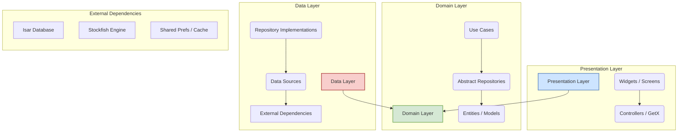

# GEMINI Project Documentation: Chessground Game App

## 1. Project Overview

This document provides a comprehensive analysis of the `chessground_game_app`, a Flutter-based mobile chess application. The app is a feature-rich chess game that allows users to play against a computer opponent (Stockfish), play offline with a friend, and customize their experience through various settings. The project is well-structured, following modern Clean Architecture principles, which ensures a separation of concerns, maintainability, and testability.

**Executive Summary:**
- **Framework:** Flutter
- **Architecture:** Clean Architecture
- **State Management:** GetX
- **Dependency Injection:** GetIt
- **Database:** Isar (local)
- **Core Features:** Play vs. AI, Offline 2-Player, Timed/Untimed Games, Game History, Board Customization.

---

## 2. Technologies & Dependencies

The project leverages a modern and robust set of packages to deliver its features.

| Dependency                  | Purpose                                                                                             |
| --------------------------- | --------------------------------------------------------------------------------------------------- |
| `flutter`                   | Core framework for building the cross-platform UI.                                                  |
| `get`                       | A powerful and lightweight solution for state management, routing, and dependency injection.        |
| `get_it`                    | Used as a service locator to implement dependency injection for the data and domain layers.           |
| `chessground`               | A sophisticated widget for rendering the chessboard and handling user interactions.                 |
| `dartchess`                 | Provides the core chess logic for move generation, validation, and game state management (FEN/PGN). |
| `stockfish_chess_engine`    | Integrates the powerful Stockfish chess engine for the "Play vs. Computer" feature.                 |
| `isar` & `isar_flutter_libs`| A fast, ACID-compliant, and easy-to-use embedded database for local data persistence.               |
| `freezed` & `json_serializable` | Code generation for creating immutable data models and handling JSON serialization.               |
| `dartz`                     | Brings functional programming patterns (like `Either` for error handling) into the project.         |
| `intl` & `flutter_localizations` | Handles internationalization (i10n) and localization (l10n).                                 |
| `build_runner`              | The primary tool for running code generators (for Isar, Freezed).                                   |
| `flutter_lints` & `mocktail`| Used for enforcing code quality and creating mocks for testing.                                     |

---

## 3. Directory Structure

The project follows a feature-first organization within the `lib` directory, which is standard for a scalable Flutter application.

```
lib/
├── core/         # Shared widgets, utilities, error handling, global features.
├── di/           # Dependency injection setup (using get_it).
├── features/     # Contains all the distinct features of the app.
│   ├── computer_game/
│   ├── home/
│   ├── offline_game/
│   ├── online_game/ (Likely a placeholder)
│   ├── puzzle/      (Likely a placeholder)
│   ├── recent_screen/
│   └── settings/
├── l10n/         # Localization and internationalization files.
├── piece_set/    # Asset definitions for different chess piece styles.
├── routes/       # Route definitions and bindings for GetX.
└── main.dart     # The main entry point of the application.
```

---

## 4. Architecture

The application is built using **Clean Architecture**. This design pattern isolates the business logic from the UI and data layers, making the application easier to test, maintain, and scale.

### Architecture Diagram (Mermaid)



### Layer Breakdown:
1.  **Presentation Layer (`features/.../presentation`)**:
    *   Contains all UI elements (Widgets and Pages).
    *   Uses **GetX** controllers (`GetxController`) to manage the state of the UI.
    *   Widgets react to state changes in the controllers and call methods on them in response to user input.
    *   These controllers execute business logic by calling Use Cases from the Domain Layer.

2.  **Domain Layer (`core/global_feature/domain`)**:
    *   The core of the application, containing all business logic. It is completely independent of Flutter or any specific UI/database framework.
    *   **Use Cases**: Encapsulate specific business rules (e.g., `PlayMove`, `SaveGameUseCase`, `GetRecentGamesUseCase`).
    *   **Repositories (Abstract)**: Define contracts (interfaces) that the Data Layer must implement. This decouples the domain logic from the data sources.
    *   **Entities**: Business objects (e.g., `ChessGame`, `Player`).

3.  **Data Layer (`core/global_feature/data`)**:
    *   **Repositories (Implementations)**: Implement the repository contracts defined in the Domain Layer. They orchestrate data fetching from one or more data sources.
    *   **Data Sources**: Responsible for fetching raw data from a specific source, such as the Isar database (`ChessGameLocalDataSource`), the Stockfish engine (`StockfishDataSource`), or a simple cache (`GameStateCacheDataSource`).

### Dependency Injection:
*   **GetIt (`di/ingection_container.dart`)**: Used to register and resolve dependencies for the Data and Domain layers. This follows the service locator pattern and ensures that components are loosely coupled.
*   **GetX Bindings (`routes/game_binding.dart`)**: Used by the Presentation Layer to provide instances of GetX controllers to the relevant screens.

---

## 5. Feature Breakdown

| Feature                 | Description                                                                                             | File References                                                                                                                              |
| ----------------------- | ------------------------------------------------------------------------------------------------------- | -------------------------------------------------------------------------------------------------------------------------------------------- |
| **Home Screen**         | The main navigation hub of the app, providing access to all game modes and settings.                    | `lib/features/home/presentation/pages/home_page.dart`                                                                                        |
| **Play vs. Computer**   | Allows the user to play a game against the Stockfish AI. Supports both timed and untimed games.         | `lib/features/computer_game/presentation/pages/game_computer_page.dart` `lib/features/computer_game/presentation/controllers/game_computer_controller.dart` |
| **Offline Game**        | A "pass and play" mode for two human players on the same device.                                        | `lib/features/offline_game/presentation/pages/offline_game_page.dart`                                                                      |
| **Game Configuration**  | Screens for choosing the game side (White/Black), setting time controls, and configuring AI difficulty. | `lib/features/computer_game/presentation/pages/side_choosing_page.dart` `lib/features/home/presentation/pages/game_time_page.dart`               |
| **Recent Games**        | Displays a list of recently played games, which can be reviewed.                                        | `lib/features/recent_screen/presentation/pages/recent_page.dart`                                                                             |
| **Settings**            | Allows customization of the board theme, piece set, sounds, and other application settings.             | `lib/features/settings/presentation/pages/settings_page.dart`                                                                                |
| **Game Controls**       | UI for undoing/redoing moves and starting a new round.                                                  | `lib/features/computer_game/presentation/pages/game_computer_page.dart` (and other game pages)                                                |

---

## 6. Known Issues & Improvements

The codebase is generally of high quality, but there are areas for improvement and incomplete features.

### TODO List
- **Incomplete Game Controls**: The `game_controls_widget.dart` and `move_list_widget.dart` have `TODO` markers for implementing navigation to the first/last move and a board flip feature.
- **Placeholder `TODO`s**: There are several generic `//TODO` comments in files like `game_computer_with_time_controller.dart` that should be resolved or removed.
- **Unused Code**: A `todo.dart` collection and its related services exist but do not appear to be used in the main application flow. This could be example code that should be cleaned up.
- **Build Configuration**: The `android/app/build.gradle.kts` file contains `TODO`s for specifying a unique Application ID and adding a release signing config. These are critical for a production build.

### Improvement Suggestions
- **Error Handling**: While the architecture supports it, more robust user-facing error handling could be added, especially for potential failures in the Stockfish engine or database operations.
- **Refactor Online/Puzzle Features**: The `online_game` and `puzzle` feature folders are mostly empty. These should either be built out or removed to reduce clutter.
- **Consolidate DI**: The project uses both `get_it` and GetX's built-in dependency injection. While this works, a future refactor could consolidate them into a single system (likely `get_it` for services and GetX for controllers) for better clarity.
- **Add Tests**: The `test` directory exists, but expanding the test suite to cover more use cases and widgets would improve the project's long-term stability.

---

## 7. Build and Run Instructions

To get the project running, you will need the Flutter SDK installed.

1.  **Get Dependencies:**
    Open a terminal in the project root and run:
    ```bash
    flutter pub get
    ```

2.  **Run Code Generation:**
    The project uses code generation for database models and data classes. Run the following command to generate the necessary files:
    ```bash
    flutter pub run build_runner build --delete-conflicting-outputs
    ```

3.  **Run the App:**
    Connect a device or start an emulator, then run:
    ```bash
    flutter run
    ```

4.  **Run Tests:**
    To execute the unit and widget tests, run:
    ```bash
    flutter test
    ```

---
*This document was generated by analyzing the project's source code.*
*Files Scanned: All `.dart`, `.yaml`, and `.md` files in the project directory.*